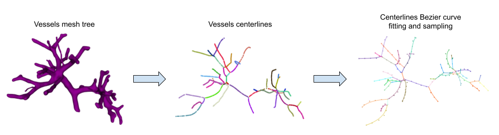
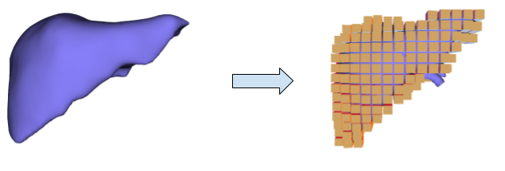

# Liver Digital Twin 

This project automates the generation of the liver digital twin given parenchyma and vessels 3D models as input.

The digital twin is built in top of a Biomechanical model, which reflects the mechanical behavior of the organ. Liver and its internal structures is considered as an heteregeneous domain respecting different mechanical properties, such as anisotropy and incompressibility. 

In this project, we consider parenchyma and vessels as two different biomechanical with different properties, then we mechanically couple both in both directions. 

## Vessel model 

Vessels are processed as set of beams, each modeled as a Finite Element Model. The processing includes centerlines extraction, bezier curves fitting and regulare points sampling as shown in the following image. 



## Parenchyma model 

Parenchyma domain is meshed with hexahedron elements and modeled using a Finite element model using a Hyperelastic material, see image bellow. 



## Installation and Usage


```bash
git clone ...
python3 DigitalTwin.py

```

## Unittests 

```bash
python3 unittests/unittest_skeletonization.py
python3 unittests/unittest_bezier_fitting.py
python3 unittests/unittest_quaternion_extraction.py
python3 unittests/unittest_vessel_mechanical_modeling.py
```

## Contributing
Pull requests are welcome. For major changes, please open an issue first to discuss what you would like to change.

Please make sure to update tests as appropriate.

## License
[MIT](https://choosealicense.com/licenses/mit/)
